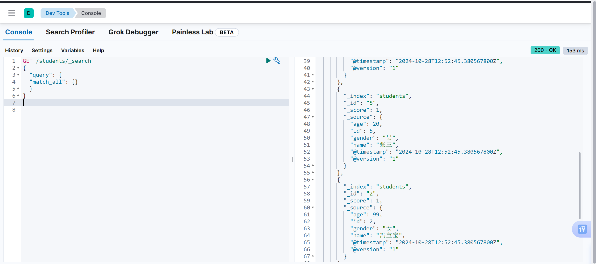

**学院：省级示范性软件学院**

**课程：高级数据库技术与应用**

**题目：**《实验四：logstash操作》

**姓名：** 翁未未

**学号：** 2200770273

**班级：** 软工2202

**日期：** 2024-10-28

**实验环境：** Elasticsearch8.12.2和Kibana8.12.2

## 一、实验目的

1. 掌握使用Logstash进行数据导入和同步的方法。
2. 学习对Elasticsearch中的日志数据进行分析和聚合操作。
3. 理解并实践实时数据同步和更新索引的技术。

## 二、实验内容

### 2.1. tomcat日志处理

**数据来源**:本地的tomcat的logs中的日志或使用下面的文件

[tomcat_logs.zip](https://www.yuque.com/attachments/yuque/0/2024/zip/550753/1729480919015-0e4652e2-c6b4-461b-822d-80919428fd83.zip)

**要求：**

1. 将tomcat的logs中的localhost_access_log访问日志导入到本地的elasticsearch中。
2. 数据导入到一个名为tomcat_logs的索引。
3. 在elasticsearch中做5个日志相关的分析，题目自拟。

**步骤：**

**1.安装和配置 Logstash**


**2.编写 Logstash 配置文件**

创建一个名为 `tomcat_logs.conf` 的配置文件，用于处理Tomcat的访问日志并将数据导入到Elasticsearch中。

```conf
input {
  file {
    path => "D://SQL//tomcat_logs//localhost_access_log.*.txt" # 文件路径
    start_position => "beginning"
    sincedb_path => "D://SQL//logstash-8.12.2//sincedb//sincedb.sql"
    codec => "plain"  # 指定文件的编码方式
  }
}

filter {
  grok {
    match => { "message" => "%{IP:client} - - \[%{HTTPDATE:timestamp}\] \"%{WORD:method} %{URIPATH:request} HTTP/%{NUMBER:http_version}\" %{NUMBER:response} (?:%{NUMBER:bytes}|-)" }
  }
  date {
    match => ["timestamp", "dd/MMM/yyyy:HH:mm:ss Z"]
    target => "@timestamp"
  }
}
output {
  elasticsearch {
    hosts => ["http://localhost:9200"]
    index => "tomcat_logs" # 指定索引名称
  }
  stdout { codec => rubydebug }
}
```

**3.运行 Logstash**

在目录`D:\SQL\logstash-8.12.2\bin`目录下打开cmd，运行命令`logstash -f "D:\SQL\logstash-8.12.2\config\tomcat_logs.conf"`来启动Logstash，运行结果：


**4.在 Elasticsearch 中进行分析**

**①最常见的响应代码**

这个查询将统计并返回最常见的响应代码（例如200, 301, 404等）。

```
GET /tomcat_logs/_search
{
  "size": 0,
  "aggs": {
    "response_codes": {
      "terms": {
        "field": "response",
        "size": 10
      }
    }
  }
}
```

运行结果：

```
{
  "took": 33,
  "timed_out": false,
  "_shards": {
    "total": 1,
    "successful": 1,
    "skipped": 0,
    "failed": 0
  },
  "hits": {
    "total": {
      "value": 3000,
      "relation": "eq"
    },
    "max_score": null,
    "hits": []
  },
  "aggregations": {
    "response_codes": {
      "doc_count_error_upper_bound": 0,
      "sum_other_doc_count": 0,
      "buckets": [
        {
          "key": "500",
          "doc_count": 781
        },
        {
          "key": "200",
          "doc_count": 749
        },
        {
          "key": "404",
          "doc_count": 738
        },
        {
          "key": "302",
          "doc_count": 732
        }
      ]
    }
  }
}
```

**②每天的请求量：**

这个查询将按天统计请求量，了解流量趋势。

```
GET /tomcat_logs/_search
{
  "size": 0,
  "aggs": {
    "requests_per_day": {
      "date_histogram": {
        "field": "@timestamp",
        "calendar_interval": "day"
      }
    }
  }
}
```

运行结果：

```
{
  "took": 37,
  "timed_out": false,
  "_shards": {
    "total": 1,
    "successful": 1,
    "skipped": 0,
    "failed": 0
  },
  "hits": {
    "total": {
      "value": 3000,
      "relation": "eq"
    },
    "max_score": null,
    "hits": []
  },
  "aggregations": {
    "requests_per_day": {
      "buckets": [
        {
          "key_as_string": "2024-08-24T00:00:00.000Z",
          "key": 1724457600000,
          "doc_count": 3
        },
        {
          "key_as_string": "2024-08-25T00:00:00.000Z",
          "key": 1724544000000,
          "doc_count": 11
        },
        {
          "key_as_string": "2024-08-26T00:00:00.000Z",
          "key": 1724630400000,
          "doc_count": 10
        },
        {
          "key_as_string": "2024-08-27T00:00:00.000Z",
          "key": 1724716800000,
          "doc_count": 11
        },
        {
          "key_as_string": "2024-08-28T00:00:00.000Z",
          "key": 1724803200000,
          "doc_count": 18
        },
        {
          "key_as_string": "2024-08-29T00:00:00.000Z",
          "key": 1724889600000,
          "doc_count": 16
        },
        {
          "key_as_string": "2024-08-30T00:00:00.000Z",
          "key": 1724976000000,
          "doc_count": 27
        },
        {
          "key_as_string": "2024-08-31T00:00:00.000Z",
          "key": 1725062400000,
          "doc_count": 30
        },
        {
          "key_as_string": "2024-09-01T00:00:00.000Z",
          "key": 1725148800000,
          "doc_count": 27
        },
        {
          "key_as_string": "2024-09-02T00:00:00.000Z",
          "key": 1725235200000,
          "doc_count": 42
        },
        {
          "key_as_string": "2024-09-03T00:00:00.000Z",
          "key": 1725321600000,
          "doc_count": 41
        },
        {
          "key_as_string": "2024-09-04T00:00:00.000Z",
          "key": 1725408000000,
          "doc_count": 51
        },
        {
          "key_as_string": "2024-09-05T00:00:00.000Z",
          "key": 1725494400000,
          "doc_count": 54
        },
        {
          "key_as_string": "2024-09-06T00:00:00.000Z",
          "key": 1725580800000,
          "doc_count": 49
        },
        {
          "key_as_string": "2024-09-07T00:00:00.000Z",
          "key": 1725667200000,
          "doc_count": 43
        },
        {
          "key_as_string": "2024-09-08T00:00:00.000Z",
          "key": 1725753600000,
          "doc_count": 54
        },
        {
          "key_as_string": "2024-09-09T00:00:00.000Z",
          "key": 1725840000000,
          "doc_count": 44
        },
        {
          "key_as_string": "2024-09-10T00:00:00.000Z",
          "key": 1725926400000,
          "doc_count": 64
        },
        {
          "key_as_string": "2024-09-11T00:00:00.000Z",
          "key": 1726012800000,
          "doc_count": 61
        },
        {
          "key_as_string": "2024-09-12T00:00:00.000Z",
          "key": 1726099200000,
          "doc_count": 76
        },
        {
          "key_as_string": "2024-09-13T00:00:00.000Z",
          "key": 1726185600000,
          "doc_count": 78
        },
        {
          "key_as_string": "2024-09-14T00:00:00.000Z",
          "key": 1726272000000,
          "doc_count": 68
        },
        {
          "key_as_string": "2024-09-15T00:00:00.000Z",
          "key": 1726358400000,
          "doc_count": 64
        },
        {
          "key_as_string": "2024-09-16T00:00:00.000Z",
          "key": 1726444800000,
          "doc_count": 83
        },
        {
          "key_as_string": "2024-09-17T00:00:00.000Z",
          "key": 1726531200000,
          "doc_count": 94
        },
        {
          "key_as_string": "2024-09-18T00:00:00.000Z",
          "key": 1726617600000,
          "doc_count": 83
        },
        {
          "key_as_string": "2024-09-19T00:00:00.000Z",
          "key": 1726704000000,
          "doc_count": 95
        },
        {
          "key_as_string": "2024-09-20T00:00:00.000Z",
          "key": 1726790400000,
          "doc_count": 102
        },
        {
          "key_as_string": "2024-09-21T00:00:00.000Z",
          "key": 1726876800000,
          "doc_count": 76
        },
        {
          "key_as_string": "2024-09-22T00:00:00.000Z",
          "key": 1726963200000,
          "doc_count": 83
        },
        {
          "key_as_string": "2024-09-23T00:00:00.000Z",
          "key": 1727049600000,
          "doc_count": 85
        },
        {
          "key_as_string": "2024-09-24T00:00:00.000Z",
          "key": 1727136000000,
          "doc_count": 90
        },
        {
          "key_as_string": "2024-09-25T00:00:00.000Z",
          "key": 1727222400000,
          "doc_count": 84
        },
        {
          "key_as_string": "2024-09-26T00:00:00.000Z",
          "key": 1727308800000,
          "doc_count": 101
        },
        {
          "key_as_string": "2024-09-27T00:00:00.000Z",
          "key": 1727395200000,
          "doc_count": 99
        },
        {
          "key_as_string": "2024-09-28T00:00:00.000Z",
          "key": 1727481600000,
          "doc_count": 76
        },
        {
          "key_as_string": "2024-09-29T00:00:00.000Z",
          "key": 1727568000000,
          "doc_count": 89
        },
        {
          "key_as_string": "2024-09-30T00:00:00.000Z",
          "key": 1727654400000,
          "doc_count": 67
        },
        {
          "key_as_string": "2024-10-01T00:00:00.000Z",
          "key": 1727740800000,
          "doc_count": 71
        },
        {
          "key_as_string": "2024-10-02T00:00:00.000Z",
          "key": 1727827200000,
          "doc_count": 67
        },
        {
          "key_as_string": "2024-10-03T00:00:00.000Z",
          "key": 1727913600000,
          "doc_count": 64
        },
        {
          "key_as_string": "2024-10-04T00:00:00.000Z",
          "key": 1728000000000,
          "doc_count": 58
        },
        {
          "key_as_string": "2024-10-05T00:00:00.000Z",
          "key": 1728086400000,
          "doc_count": 57
        },
        {
          "key_as_string": "2024-10-06T00:00:00.000Z",
          "key": 1728172800000,
          "doc_count": 59
        },
        {
          "key_as_string": "2024-10-07T00:00:00.000Z",
          "key": 1728259200000,
          "doc_count": 46
        },
        {
          "key_as_string": "2024-10-08T00:00:00.000Z",
          "key": 1728345600000,
          "doc_count": 46
        },
        {
          "key_as_string": "2024-10-09T00:00:00.000Z",
          "key": 1728432000000,
          "doc_count": 41
        },
        {
          "key_as_string": "2024-10-10T00:00:00.000Z",
          "key": 1728518400000,
          "doc_count": 22
        },
        {
          "key_as_string": "2024-10-11T00:00:00.000Z",
          "key": 1728604800000,
          "doc_count": 39
        },
        {
          "key_as_string": "2024-10-12T00:00:00.000Z",
          "key": 1728691200000,
          "doc_count": 34
        },
        {
          "key_as_string": "2024-10-13T00:00:00.000Z",
          "key": 1728777600000,
          "doc_count": 22
        },
        {
          "key_as_string": "2024-10-14T00:00:00.000Z",
          "key": 1728864000000,
          "doc_count": 26
        },
        {
          "key_as_string": "2024-10-15T00:00:00.000Z",
          "key": 1728950400000,
          "doc_count": 24
        },
        {
          "key_as_string": "2024-10-16T00:00:00.000Z",
          "key": 1729036800000,
          "doc_count": 23
        },
        {
          "key_as_string": "2024-10-17T00:00:00.000Z",
          "key": 1729123200000,
          "doc_count": 18
        },
        {
          "key_as_string": "2024-10-18T00:00:00.000Z",
          "key": 1729209600000,
          "doc_count": 12
        },
        {
          "key_as_string": "2024-10-19T00:00:00.000Z",
          "key": 1729296000000,
          "doc_count": 11
        },
        {
          "key_as_string": "2024-10-20T00:00:00.000Z",
          "key": 1729382400000,
          "doc_count": 7
        },
        {
          "key_as_string": "2024-10-21T00:00:00.000Z",
          "key": 1729468800000,
          "doc_count": 4
        }
      ]
    }
  }
}
```

**③访问最多的URL**

这个查询查找被访问次数最多的URL，可以帮助了解哪些页面最受欢迎。

```
GET /tomcat_logs/_search
{
  "size": 0,
  "aggs": {
    "top_urls": {
      "terms": {
        "field": "request.keyword",
        "size": 10
      }
    }
  }
}
```

运行结果：

```
{
  "took": 3,
  "timed_out": false,
  "_shards": {
    "total": 1,
    "successful": 1,
    "skipped": 0,
    "failed": 0
  },
  "hits": {
    "total": {
      "value": 3000,
      "relation": "eq"
    },
    "max_score": null,
    "hits": []
  },
  "aggregations": {
    "top_urls": {
      "doc_count_error_upper_bound": 0,
      "sum_other_doc_count": 1664,
      "buckets": [
        {
          "key": "/demo1/",
          "doc_count": 153
        },
        {
          "key": "/examples/jsp/images/execute.gif",
          "doc_count": 141
        },
        {
          "key": "/static/js/app.js",
          "doc_count": 139
        },
        {
          "key": "/about",
          "doc_count": 137
        },
        {
          "key": "/static/css/style.css",
          "doc_count": 134
        },
        {
          "key": "/demo/",
          "doc_count": 133
        },
        {
          "key": "/blog/post/2",
          "doc_count": 127
        },
        {
          "key": "/demo/hello",
          "doc_count": 127
        },
        {
          "key": "/examples/jsp/images/return.gif",
          "doc_count": 124
        },
        {
          "key": "/blog/post/3",
          "doc_count": 121
        }
      ]
    }
  }
}
```

**④客户端IP地址数量统计**

这个查询统计共有多少个客户端ip地址。

```
GET /tomcat_logs/_search
{
  "size": 0,
  "aggs": {
    "client_ip_count": {
      "terms": {
        "field": "client.keyword"
      }
    }
  }
}
```

运行结果：

```
{
  "took": 1,
  "timed_out": false,
  "_shards": {
    "total": 1,
    "successful": 1,
    "skipped": 0,
    "failed": 0
  },
  "hits": {
    "total": {
      "value": 3000,
      "relation": "eq"
    },
    "max_score": null,
    "hits": []
  },
  "aggregations": {
    "client_ip_count": {
      "doc_count_error_upper_bound": 0,
      "sum_other_doc_count": 0,
      "buckets": [
        {
          "key": "0:0:0:0:0:0:0:1",
          "doc_count": 3000
        }
      ]
    }
  }
}
```

**⑤按请求方法（GET, POST）统计请求数量**

```
GET /tomcat_logs/_search
{
  "size": 0,
  "aggs": {
    "request_method_count": {
      "terms": {
        "field": "method.keyword"
      }
    }
  }
}
```

运行结果：

```
{
  "took": 10,
  "timed_out": false,
  "_shards": {
    "total": 1,
    "successful": 1,
    "skipped": 0,
    "failed": 0
  },
  "hits": {
    "total": {
      "value": 3000,
      "relation": "eq"
    },
    "max_score": null,
    "hits": []
  },
  "aggregations": {
    "request_method_count": {
      "doc_count_error_upper_bound": 0,
      "sum_other_doc_count": 0,
      "buckets": [
        {
          "key": "POST",
          "doc_count": 1547
        },
        {
          "key": "GET",
          "doc_count": 1453
        }
      ]
    }
  }
}
```


### 2.2. 数据转换和传输

**要求：**

1. 将本地的mysql数据库中的一张表导入到本地的elasticsearch中。
2. 数据库表更新后，数据能够自动同步到elasticsearch中。

**步骤：**

**1.配置文件，命名为mysql_elasticsearch.conf**

```
input {
  jdbc {
    jdbc_driver_library => "D://SQL//mysql-connector-j-9.1.0.jar"
    jdbc_driver_class => "com.mysql.cj.jdbc.Driver"
    jdbc_connection_string => "jdbc:mysql://localhost:3306/jdbc_demo"
    jdbc_user => "root"
    jdbc_password => "2003729"
    statement => "SELECT * FROM student"
    schedule => "*/5 * * * * *" # 每5秒运行一次
  }
}

output {
  elasticsearch {
    hosts => ["http://localhost:9200"]
    index => "students" # 索引名称
    document_id => "%{id}" # 表中id字段作为主键
  }
  stdout { codec => json_lines }
}
```

**2.运行 Logstash**

在目录`D:\SQL\logstash-8.12.2\bin`目录下打开cmd，运行命令`logstash -f "D:\SQL\logstash-8.12.2\config\mysql_elasticsearch.conf"`来启动Logstash，运行结果：


**3.在elasticsearch中查询，看是否导入成功**

```
GET /students/_search
{
  "query": {
  "match_all": {}
  }
}
```

查询结果：

```
{
  "took": 181,
  "timed_out": false,
  "_shards": {
    "total": 1,
    "successful": 1,
    "skipped": 0,
    "failed": 0
  },
  "hits": {
    "total": {
      "value": 4,
      "relation": "eq"
    },
    "max_score": 1,
    "hits": [
      {
        "_index": "students",
        "_id": "1",
        "_score": 1,
        "_source": {
          "age": 18,
          "id": 1,
          "gender": "男",
          "name": "张楚岚",
          "@timestamp": "2024-10-28T12:37:30.436174500Z",
          "@version": "1"
        }
      },
      {
        "_index": "students",
        "_id": "4",
        "_score": 1,
        "_source": {
          "age": 19,
          "id": 4,
          "gender": "女",
          "name": "陆玲儿",
          "@timestamp": "2024-10-28T12:37:30.436174500Z",
          "@version": "1"
        }
      },
      {
        "_index": "students",
        "_id": "3",
        "_score": 1,
        "_source": {
          "age": 21,
          "id": 3,
          "gender": "男",
          "name": "王也",
          "@timestamp": "2024-10-28T12:37:30.436174500Z",
          "@version": "1"
        }
      },
      {
        "_index": "students",
        "_id": "2",
        "_score": 1,
        "_source": {
          "age": 99,
          "id": 2,
          "gender": "女",
          "name": "冯宝宝",
          "@timestamp": "2024-10-28T12:37:30.436174500Z",
          "@version": "1"
        }
      }
    ]
  }
}
```

原student表：


从查询结果来看,本地的mysql数据库中的student表已经导入到本地的elasticsearch中。

**4.在student表中插入数据**

```
INSERT INTO student VALUES ('5', '张三', 20, '男');
```

查看student表：


**5.在elasticsearch中查看是否更新**



可以看到，数据库表更新后，数据能够自动同步到elasticsearch中。

## 三、问题及解决办法

**问题：**对名为`tomcat_logs`的索引中的`response`字段进行聚合操作时出现了问题，`response`字段被标识为`text`类型，而`text`类型的字段默认不支持聚合和排序操作，因为它们是为全文搜索优化的，而不是为了存储单个值。

**解决办法：**设置`fielddata=true`，更新映射，为`response`字段设置fielddata=true

```
PUT /tomcat_logs/_mapping
{
  "properties": {
    "response": {
      "type": "text",
      "fielddata": true
    }
  }
}
```
