**学院：省级示范性软件学院**

**课程：高级数据库技术与应用**

**题目：**《实验五：Kibana操作》

**姓名：** 翁未未

**学号：** 2200770273

**班级：** 软工2202

**日期：** 2024-11-11

**实验环境：** Elasticsearch8.12.2和Kibana8.12.2

## 一、实验目的

1. **理解数据聚合的概念：** 实验旨在让学生理解数据聚合的重要性，并学会如何在Kibana中使用聚合操作来分析和处理数据。
2. **提高数据可视化技能：** 学生将通过创建和配置Kibana中的可视化图表，提高数据可视化的技能，以便更好地理解和展示数据分析结果。
3. **学习构建交互式仪表盘：** 实验要求学生将多个可视化图表整合到一个或多个仪表盘中，并添加控件、文字描述和筛选器，以构建一个交互式的数据分析平台。

## 二、实验内容

**要求：**

1. 使用Kibana可视化图表完成[实验三 聚合操作](https://www.yuque.com/u369937/wskurb/nizzczly3ahu08t9)的 10道题
2. 将做好的10个可视化放到1个或2个仪表盘中
3. 仪表盘中增加一些控件，文字描述，筛选等

**参考:**

https://bbs.fanruan.com/thread-135967-1-1.html

**步骤：**

#### 2.1 可视化图表

1.统计每个产品类别的总销售额

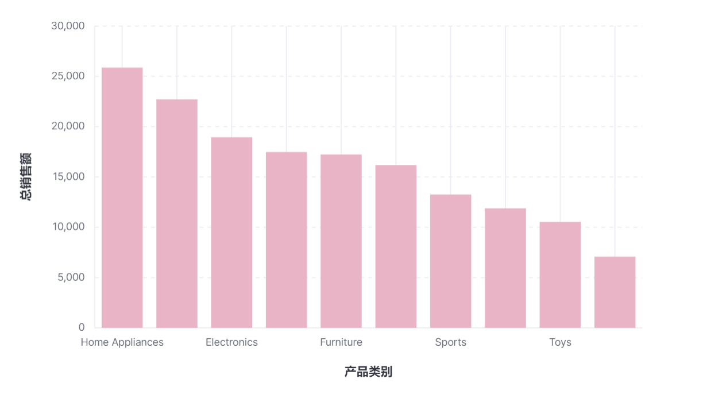

2.每个城市的平均订单金额

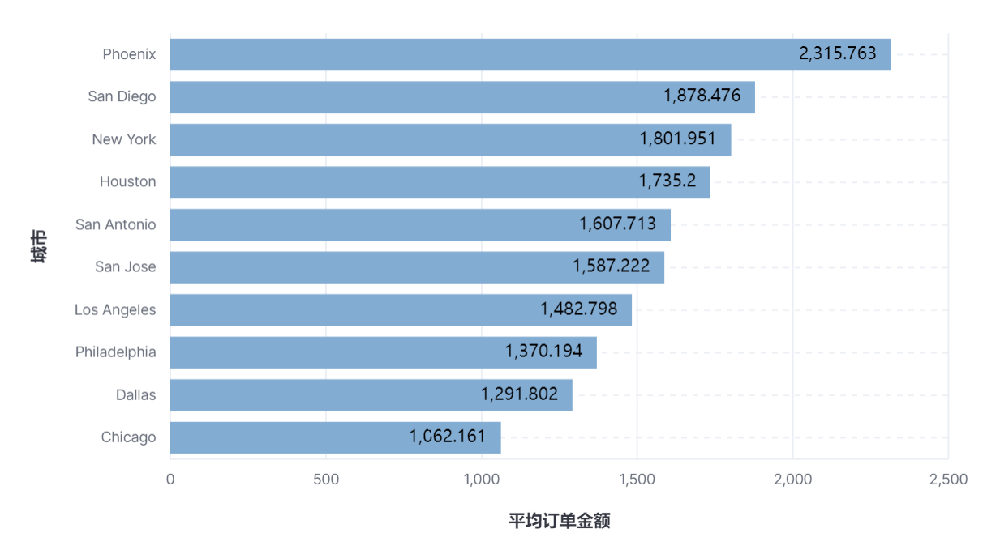

3.销量最高的前5个产品

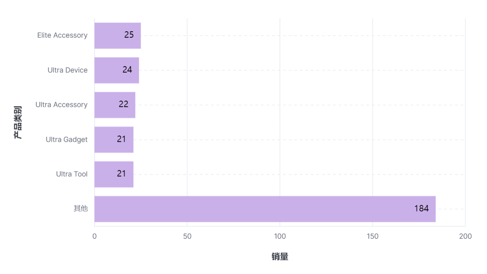

4.男性和女性客户的平均年龄

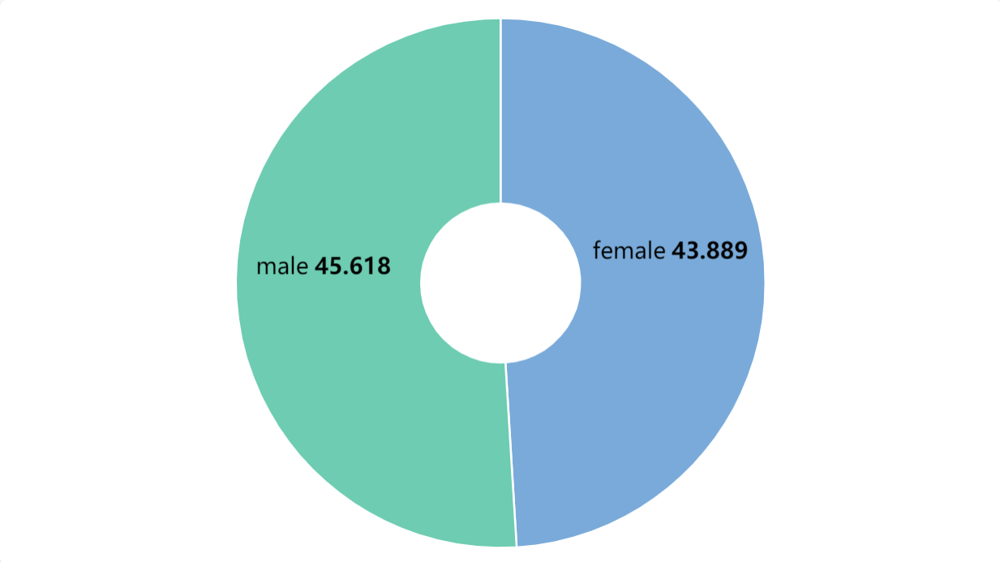

5.每种支付方式的使用次数和总金额

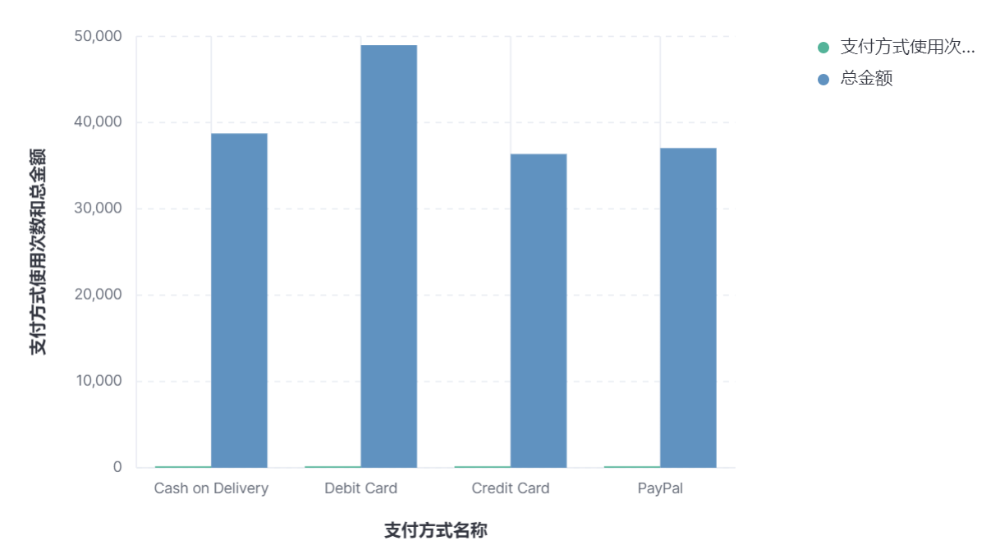

6.每月的总销售额

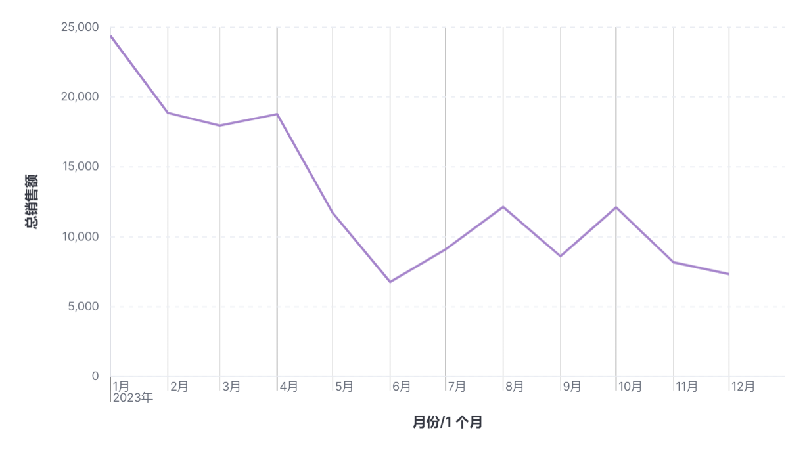

7.平均订单金额最高的前3个客户

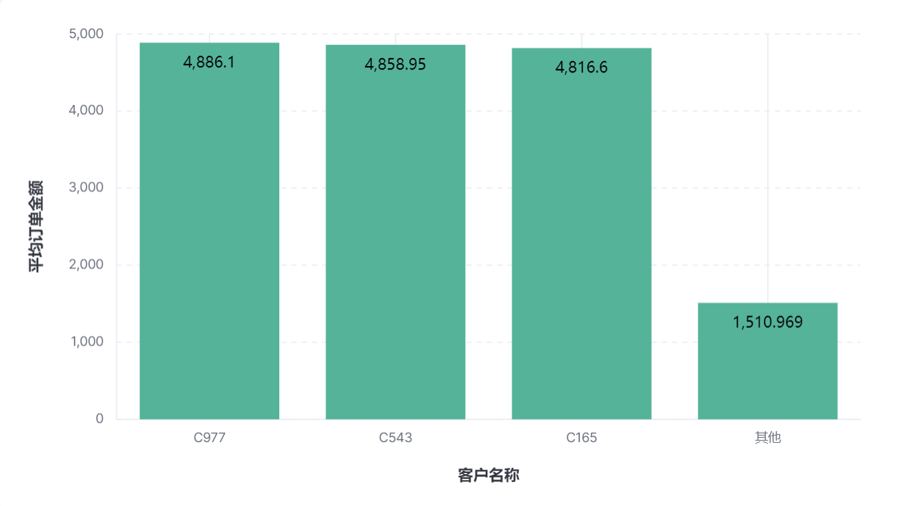

8.每个产品类别的平均单价

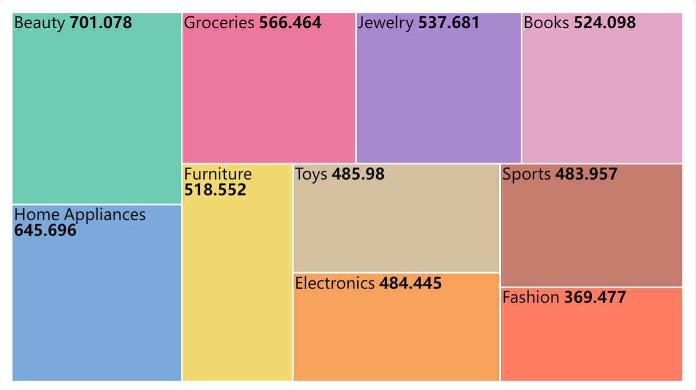

9.每个产品类别中的商品数量

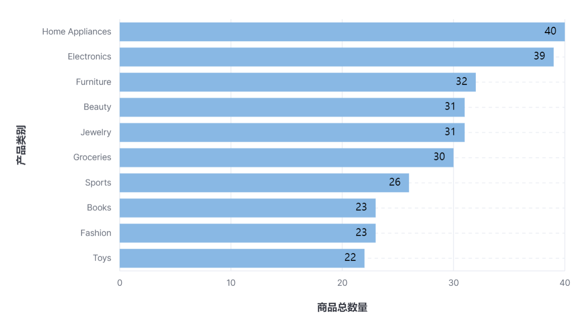

10.男性和女性的平均订单金额

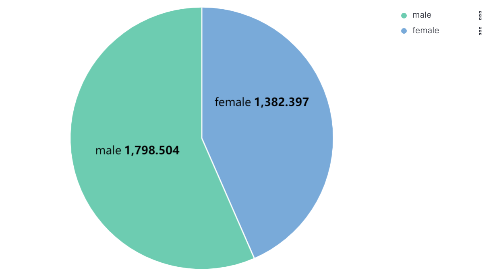

#### 2.2 仪表盘

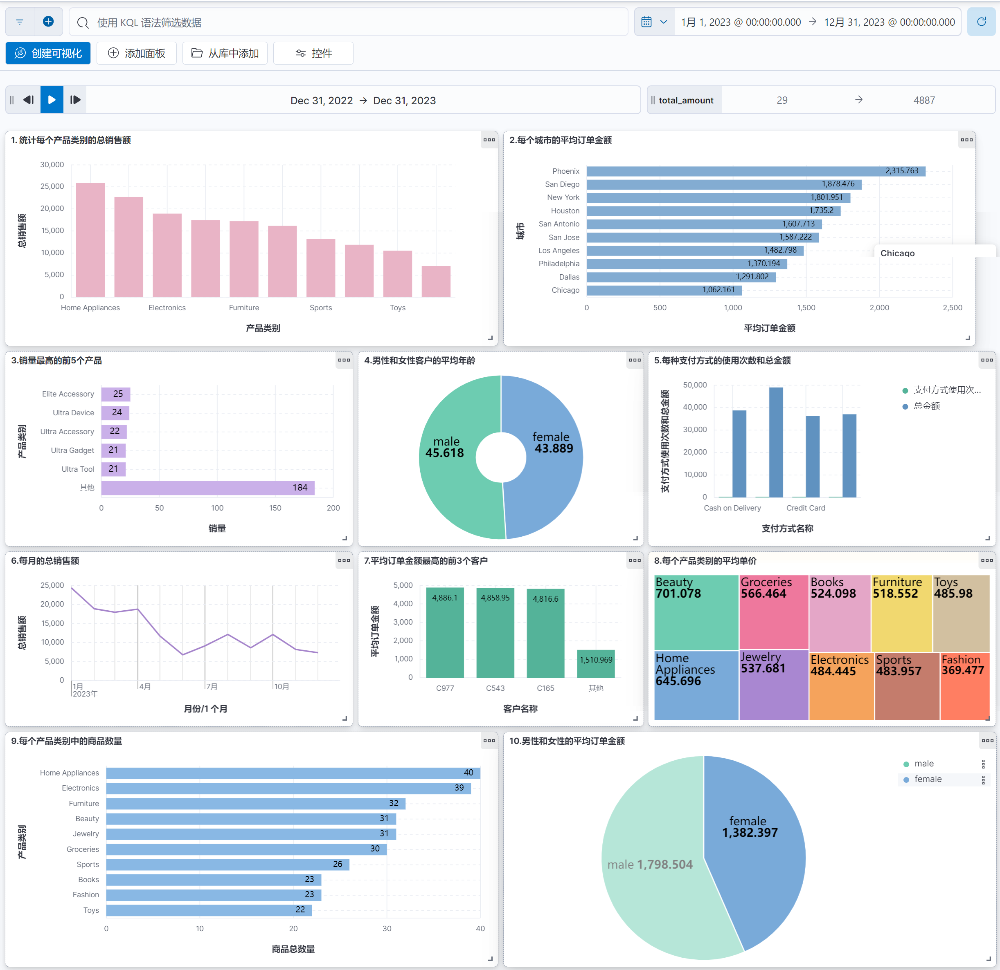

## 三、问题及解决办法

**问题：**Kibana可视化图表无法正确显示数据或统计的数据不完全。

**解决方法：**将该数据的索引删除，重新建立索引，插入数据。